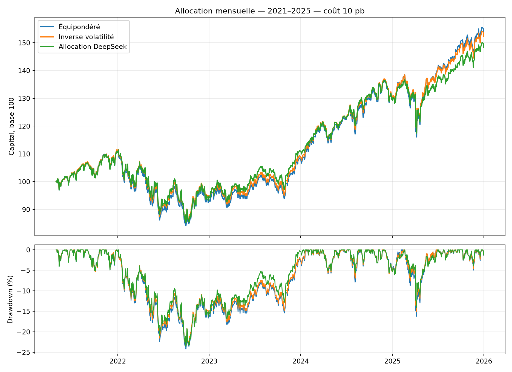

# Expérience d’allocation mensuelle

Mode : live. Du 2021-05-01 au 2025-12-31, capital initial 100 unités.
Décision après clôture du mois précédent ; exécution au premier cours de clôture suivant.
Coûts : 10 pb, poids cibles ≤ 40%, turnover mensuel ≤ 10%.

| Stratégie | Capital final | PnL | Rendement annualisé | Volatilité | Drawdown max. | Décisions rejetées |
|---|---:|---:|---:|---:|---:|---:|
| Équipondéré | 153.55 | +53.55 | 9.62% | 15.66% | -24.20% | 0/56 |
| Inverse volatilité | 152.26 | +52.26 | 9.42% | 15.08% | -23.44% | 0/56 |
| Allocation DeepSeek | 148.39 | +48.39 | 8.82% | 14.87% | -23.50% | 34/56 |

Les métriques de risque sont calculées sur les rendements quotidiens ; le taux sans risque est nul.
La politique inverse volatilité utilise les 252 derniers rendements quotidiens, puis plafonne les poids.
Chaque politique est soumise au même validateur et à la même exécution. Un rejet conserve les positions existantes.
Les frais sont financés par le portefeuille ; le coût porte sur la moitié du volume réellement échangé.

Cette expérience historique est exploratoire : le modèle peut connaître des événements futurs par son préentraînement.
Les coûts API et humains sont exclus. Les données ajustées ne sont pas des historiques de prix point-in-time.
Les dates et conventions diffèrent du backtest initial du mémoire ; ses métriques ne sont pas remplacées.

