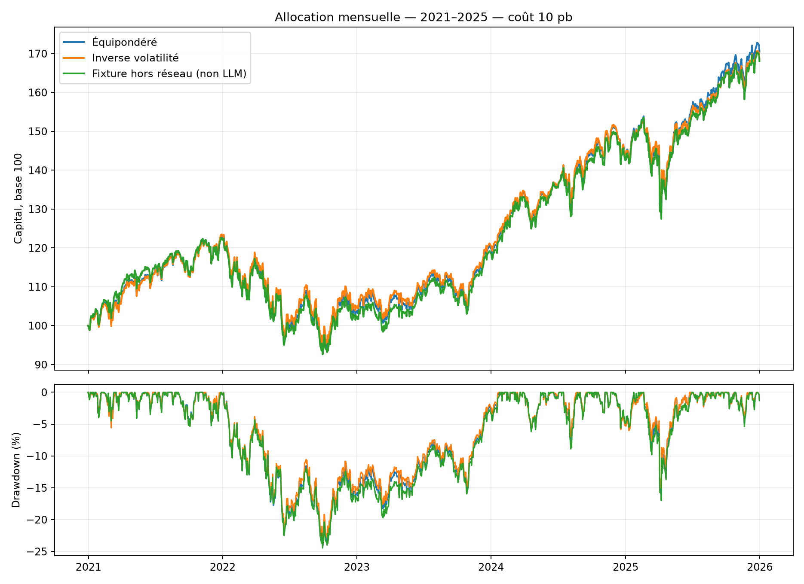

# Expérience d’allocation mensuelle

**Test technique : aucune décision de ce run ne provient d’un LLM.**
Mode : offline. Du 2021-01-01 au 2025-12-31, capital initial 100 unités.
Décision après clôture du mois précédent ; exécution au premier cours de clôture suivant.
Coûts : 10 pb, poids cibles ≤ 40%, turnover mensuel ≤ 10%.

| Stratégie | Capital final | PnL | Rendement annualisé | Volatilité | Drawdown max. | Décisions rejetées |
|---|---:|---:|---:|---:|---:|---:|
| Équipondéré | 170.51 | +70.51 | 11.26% | 15.63% | -24.20% | 0/60 |
| Inverse volatilité | 168.59 | +68.59 | 11.01% | 15.07% | -23.44% | 0/60 |
| Fixture hors réseau (non LLM) | 168.10 | +68.10 | 10.95% | 15.81% | -24.45% | 0/60 |

Les métriques de risque sont calculées sur les rendements quotidiens ; le taux sans risque est nul.
La politique inverse volatilité utilise les 252 derniers rendements quotidiens, puis plafonne les poids.
Chaque politique est soumise au même validateur et à la même exécution. Un rejet conserve les positions existantes.
Les frais sont financés par le portefeuille ; le coût porte sur la moitié du volume réellement échangé.

Cette expérience historique est exploratoire : le modèle peut connaître des événements futurs par son préentraînement.
Les coûts API et humains sont exclus. Les données ajustées ne sont pas des historiques de prix point-in-time.
Les dates et conventions diffèrent du backtest initial du mémoire ; ses métriques ne sont pas remplacées.

